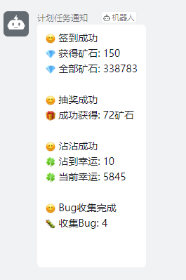
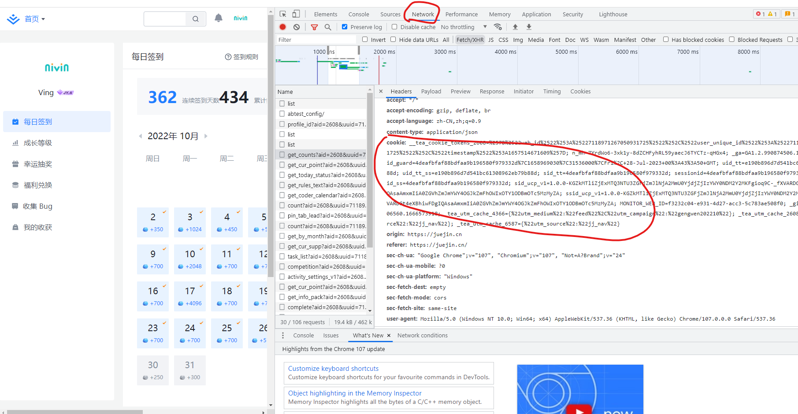
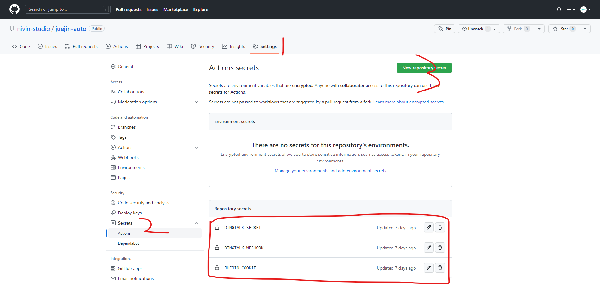
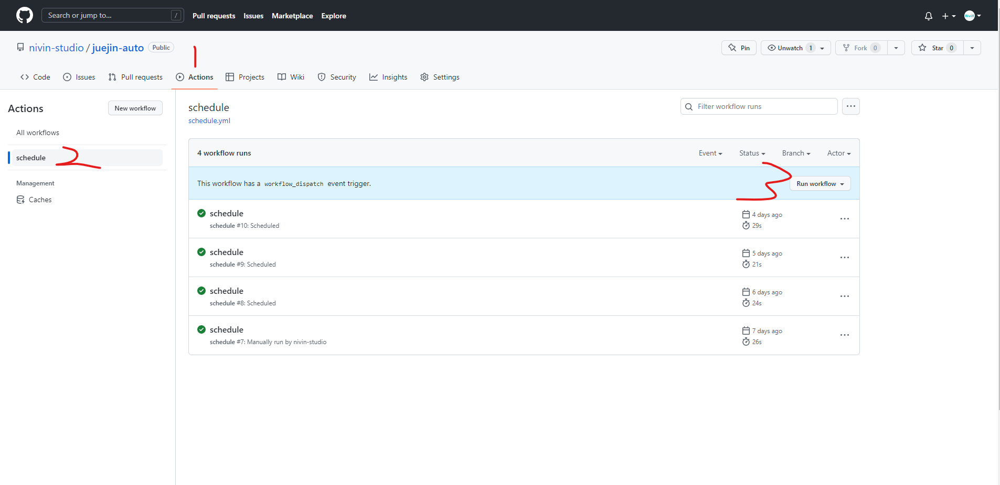

# juejin-auto
🔥掘金定时自动签到、抽奖、沾喜气、收集Bug、钉钉通知

## 效果


## 如何使用

### 1. 获取掘金cookie
登录掘金后，`F12` 打开浏览器调试模式，选择 `Network` 在列表中随便选择一个接口，在 `Request Headers` 中找到 `cookie` 的值.


### 2. 获取钉钉机器webhook地址和secret加签密钥
请参考 [钉钉自定义机器人接入](https://open.dingtalk.com/document/group/custom-robot-access)

### 3. 添加Github Actions secrets
完成如上两个步骤，我们已经获取到 `掘金cookie`, `钉钉机器人webhook`, `钉钉机器人secret`, 我们需要将这个三个值，添加到项目的 `Actions secrets` 中去。


- JUEJIN_COOKIE: 填写掘金cookie的值
- DINGTALK_WEBHOOK: 填写钉钉机器人webhook的值
- DINGTALK_SECRET: 填写钉钉机器人secret的值

### 4. 启动执行
选择项目 `Actions`, 点击 `Run workflow` 即可启动运行项目。


如果需要定时执行，请将 `.github/workflows/schedule.yml` 文件下的 `schedule` 的注释去掉。

>  注意 github 的 cron 时区是UTC，所以如下例子是每天早上8:45执行一次。但即便如此，也可能执行会有所延迟，毕竟免费的东西，用的人多了就会拥堵。

```yml
name: schedule

on:
  schedule:
  - cron: '45 0 * * *'
  workflow_dispatch:

......

```
